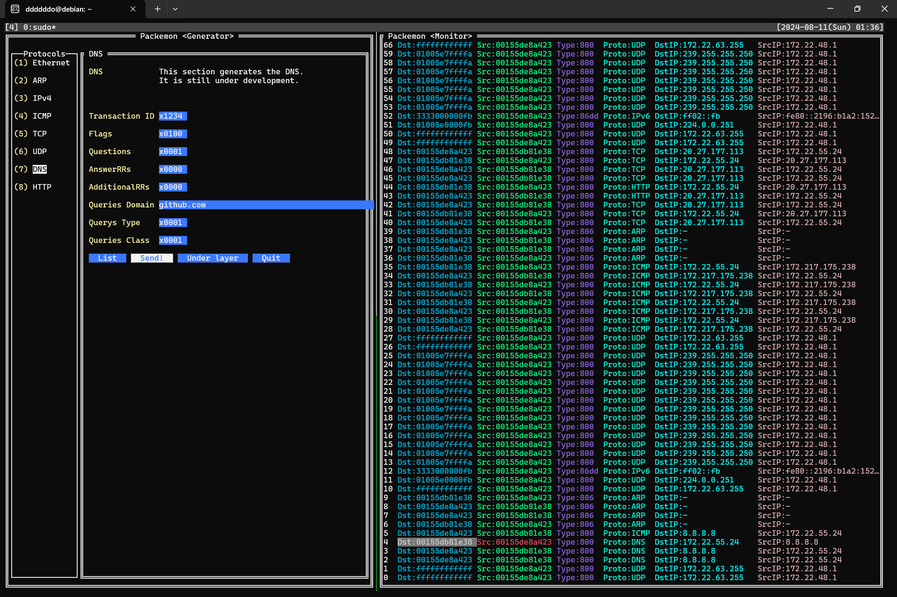
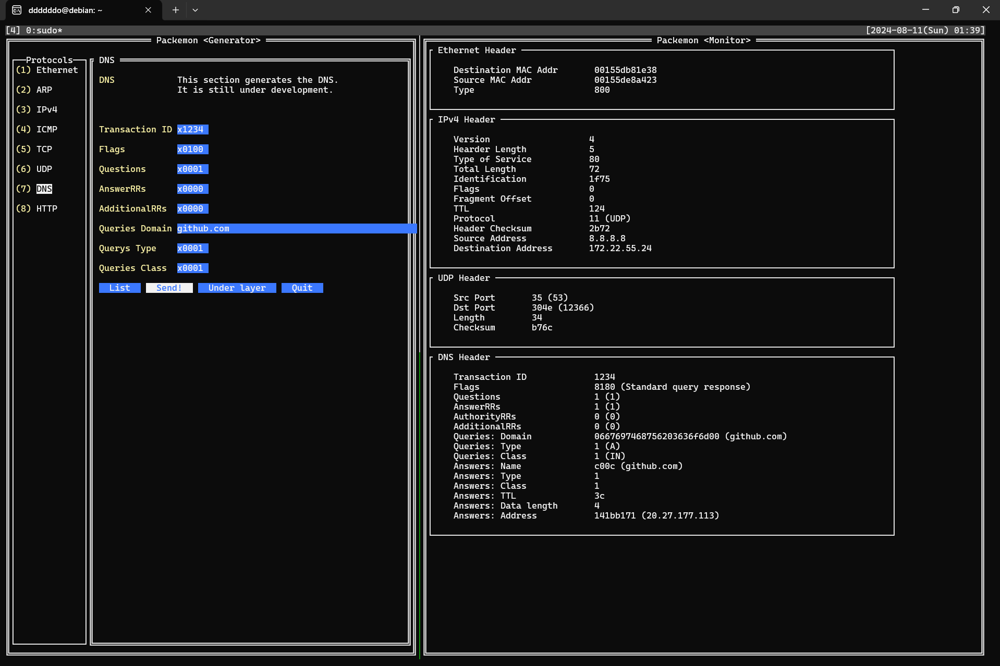
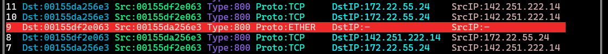
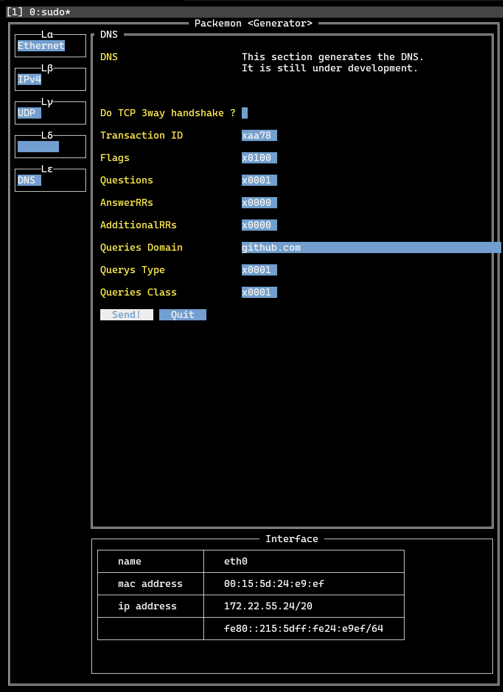
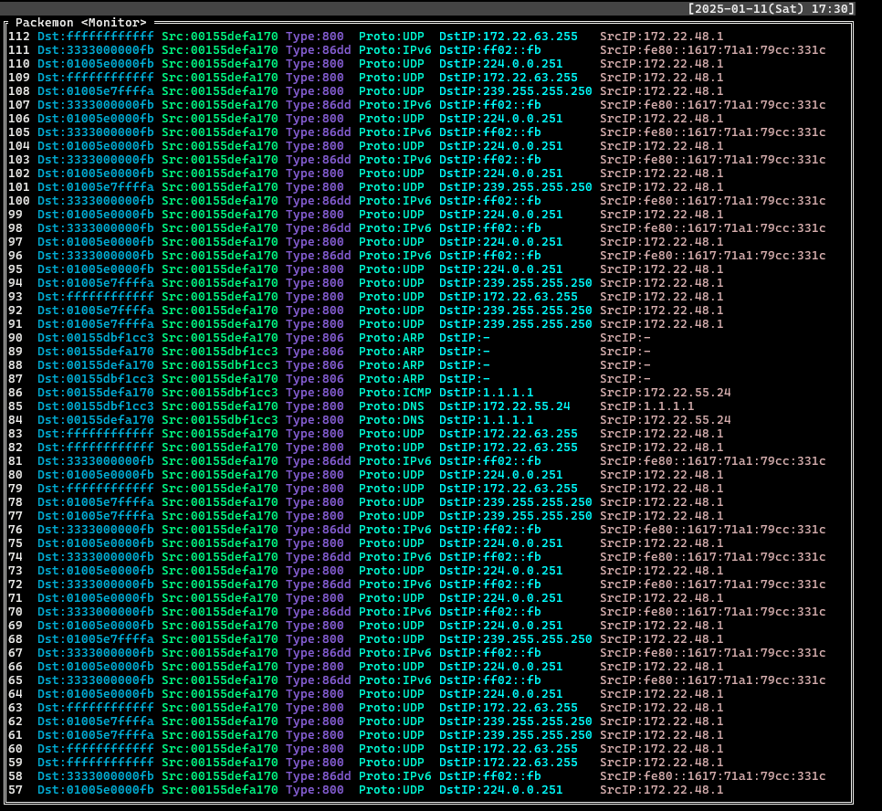
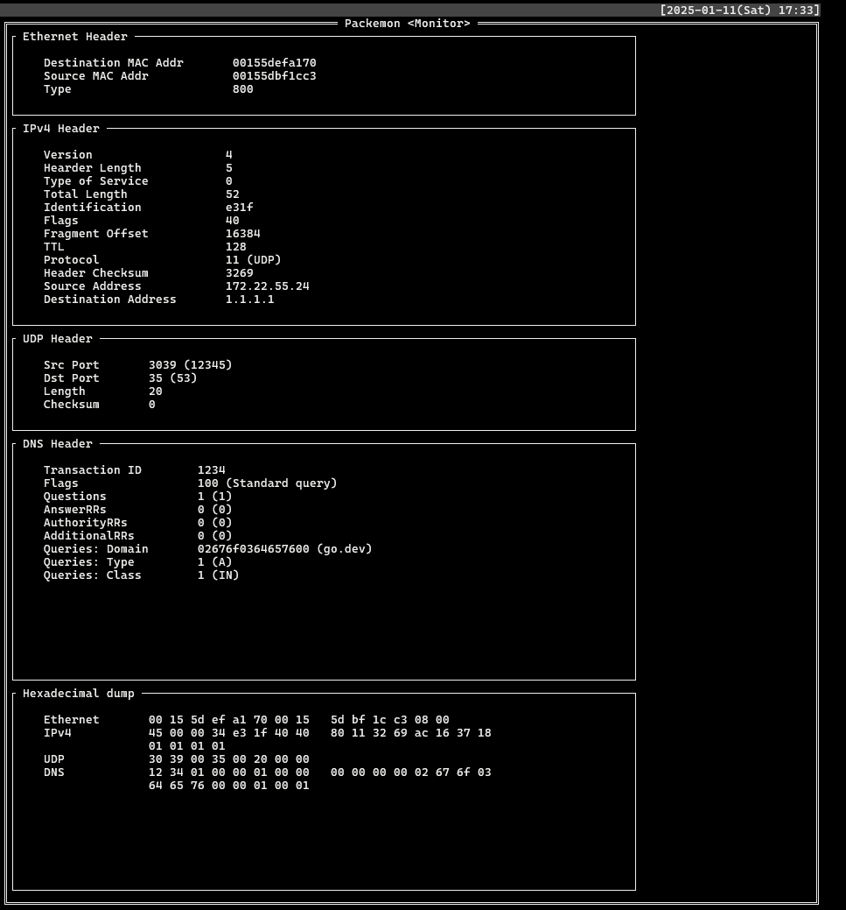
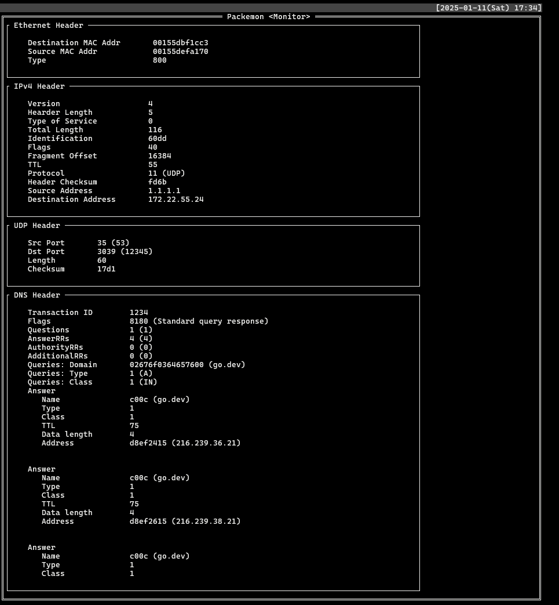

# Packémon

Packet monster, or `Packémon` for short! (っ‘-’)╮=͟͟͞͞◒ ヽ( '-'ヽ) <br>

<!--  -->
https://github.com/user-attachments/assets/dbb0baeb-a0b8-4e18-8647-ac05020f83d5

TUI tool for generating packets of arbitrary input and monitoring packets on any network interfaces (default: `eth0`). **This tool is not available for Windows and macOS. I have confirmed that it works on Linux (Debian and Ubuntu on WSL2) .**<br>

I intend to develop it patiently🌴

The images of Packemon on REDME should be used as reference only, as they may look different from the actual Packemon.

> [!WARNING]
> This tool is implemented with protocol stacks from scratch and utilizes raw socket.</br>
> There may be many bugs. If you find a bug, I would be glad if you raise an issue or give me a pull request!

## Feature

This TUI tool has two major functions: packet generation and packet monitoring.




This image shows packemon running in Generator / Monitor mode.</br>
DNS query packet generated by Generator on the left is shown in **40** line of the Monitor. DNS query response packet is shown as **41** line, and a more detailed view of it is shown in the image below.</br>
See **[here](https://github.com/ddddddO/packemon#sending-dns-query-and-monitoring-dns-response)** for detailed instructions.

Packemon's Monitor allows user to select each packet by pressing `Enter` key. Then, select any line and press `Enter` key to see the details of the desired packet. Pressing `Esc` key in the packet detail screen will return you to the original packet list screen.

### Generator

- Send generated packets to any network interfaces.
  - You can specify network interface with `--interface` flag. Default is `eth0`.

- Packets of various protocols are supported.

  <details><summary>details</summary>

  - [x] Ethernet
  - [x] ARP (WIP)
  - [x] IPv4 (WIP)
  - [x] IPv6 (WIP)
  - [x] ICMPv4 (WIP)
  - [ ] ICMPv6
  - [x] TCP (WIP)
  - [x] UDP (WIP)
  - [ ] TLSv1.2 (WIP)
    - This tool is not very useful because the number of cipher suites it supports is still small, but an environment where you can try it out can be found [here](./cmd/debugging/https-server/README.md).
      - TCP 3way handshake ~ TLS handshake ~ TLS Application data (encrypted HTTP)
    - Supported cipher suites include
      - `TLS_RSA_WITH_AES_128_GCM_SHA256`
    - You can check the server for available cipher suites with the following command
      - `nmap --script ssl-enum-ciphers -p 443 <server ip>`
  - [ ] TLSv1.3
  - [x] DNS (WIP)
  - [x] HTTP (WIP)
  - [ ] xxxxx....
  - [ ] Routing Protocols
    - IGP (Interior Gateway Protocol)
      - [ ] OSPF (Open Shortest Path First)
      - [ ] EIGRP (Enhanced Interior Gateway Routing Protocol)
      - [ ] RIP (Routing Information Protocol)
    - EGP (Exterior Gateway Protocol)
      - [ ] BGP (Border Gateway Protocol)
        - [Currently there is only debug mode](./cmd/debugging/bgp/README.md)
          - TCP 3way handshake ~ Open ~ Keepalive ~ Update ~ Notification

  </details>

>[!WARNING]
> While using Generator mode, TCP RST packets automatically sent out by the kernel are dropped. When this mode is stopped, the original state is restored. Probably😅.
> Incidentally, dropping RST packets is done by running [the eBPF program](./egress_control/).
> The background note incorporating the eBPF is the POST of X around [here](https://x.com/ddddddOpppppp/status/1798715056513056881). 

### Monitor

- Monitor any network interfaces.
  - You can specify network interface with `--interface` flag. Default is `eth0`.

- Specified packets can be saved to pcapng file.

- Packets of various protocols are supported.

  <details><summary>details</summary>

  - [x] Ethernet
  - [x] ARP
  - [x] IPv4 (WIP)
  - [x] IPv6 (WIP)
  - [x] ICMPv4 (WIP)
  - [ ] ICMPv6
  - [x] TCP (WIP)
  - [x] UDP
  - [x] TLSv1.2 (WIP)
  - [ ] TLSv1.3
  - [ ] DNS (WIP)
    - [x] DNS query
    - [x] DNS query response
    - [ ] xxxxx....
  - [ ] HTTP (WIP)
    - [x] HTTP GET request
    - [x] HTTP GET response
    - [ ] xxxxx....
  - [ ] xxxxx....
  - [ ] Routing Protocols
    - IGP (Interior Gateway Protocol)
      - [ ] OSPF (Open Shortest Path First)
      - [ ] EIGRP (Enhanced Interior Gateway Routing Protocol)
      - [ ] RIP (Routing Information Protocol)
    - EGP (Exterior Gateway Protocol)
      - [ ] BGP (Border Gateway Protocol)

  </details>

>[!WARNING]
> If packet parsing fails, it is indicated by “Proto:ETHER” as shown in the following image. 
>
> 
>
> If you want to check the details of the packet, you can select the line, save it to a pcapng file, and import it into Wireshark or other software🙏

## Installation

<pre>

<b>git clone & Go</b>
# Recomended (Clone this repository and require 'Dependencies' section of https://ebpf-go.dev/guides/getting-started/#ebpf-c-program)
$ cd egress_control/ && go generate && cd -
$ go build -o packemon cmd/packemon/*.go
$ ls | grep packemon
$ mv packemon /usr/local/bin/

<b>Go</b>
# Deprecated (In some environments, RST packets may be sent during TCP 3-way handshake)
$ go install github.com/ddddddO/packemon/cmd/packemon@latest

<b>deb</b>
$ export PACKEMON_VERSION=X.X.X
$ curl -o packemon.deb -L https://github.com/ddddddO/packemon/releases/download/v$PACKEMON_VERSION/packemon_$PACKEMON_VERSION-1_amd64.deb
$ dpkg -i packemon.deb

<b>rpm</b>
$ export PACKEMON_VERSION=X.X.X
$ yum install https://github.com/ddddddO/packemon/releases/download/v$PACKEMON_VERSION/packemon_$PACKEMON_VERSION-1_amd64.rpm

<b>apk</b>
$ export PACKEMON_VERSION=X.X.X
$ curl -o packemon.apk -L https://github.com/ddddddO/packemon/releases/download/v$PACKEMON_VERSION/packemon_$PACKEMON_VERSION-1_amd64.apk
$ apk add --allow-untrusted packemon.apk

</pre>

## Usage

- Generator
  ```console
  sudo packemon --send
  ```

- Monitor
  ```console
  sudo packemon
  ```

## Usecase
### Sending DNS query and Monitoring DNS response

1. setup
    ```sh
    # Generator
    $ sudo packemon --send
    ```

    ```sh
    # Monitor
    $ sudo packemon
    ```

    ← Generator | Monitor →

    

2. Generator
    - `Lα` > `Ethernet` > `Ether Type` > **IPv4**
    - `Lβ` > `IPv4` > `Protocol` > **UDP**
    - `Lβ` > `IPv4` > `Destination IP Addr` > **1.1.1.1**
      - Enter the address of DNS resolver here. Above is the address of Cloudflare resolver.
    - `Lγ` > `UDP` > `Destination Port` > **53**
    - `Lγ` > `UDP` > `Automatically calculate length ?` > **(Check!)**
    - `Lε` > `DNS` > `Queries Domain` > **go.dev**
      - Enter here the domain for which you want to name resolution.

    - `Lε` > `DNS` > Click on **Send!**
      - At this time, DNS query is sent with the contents set so far.

    

3. Monitor

    - Find records where `Proto`: **DNS** and `DstIP` or `SrcIP` is **1.1.1.1**. Select each record to see the packet structure of the DNS query and the packet structure of the DNS response.

      - List
        

      - DNS query (`DstIP: 1.1.1.1`)
        

      - DNS response (`SrcIP: 1.1.1.1`)
        

## Another feature

<details>

<summary>⚠️ Might be repealed</summary>

The local node's browser can monitor packets from remote nodes or send arbitrary packets from remote nodes.

```
                                         +-------------------------------------+
+----------------------+                 | REMOTE NODE                         |
| LOCAL NODE (Browser) |                 | $ sudo packemon-api --interface xxx |
|  Monitor   <---------|-- WebSocket   --|--> HTTP GET  /ws  <-----+           |
|  Generator  ---------|-- POST packet --|--> HTTP POST /packet    |           |
+----------------------+                 |      -> parse packet    |           |                  +---------------+
                                         |           -> Network Interface -----|-- Send packet -->| TARGET NODE x |
                                         +-------------------------------------+                  |               |
                                                                                                  +---------------+
```

- Remote node
  

- Local node
  


>[!WARNING]
> Please note that the following is dangerous.

The following procedure is an example of how you can expose packemon-api to the outside world and monitor and send remote node packets on your browser.

1. (REMOTE) Please install `packemon-api` and run.
    ```console
    $ go install github.com/ddddddO/packemon/cmd/packemon-api@latest
    $ sudo packemon-api --interface wlan0
    ```
1. (REMOTE) Run [`ngrok`](https://ngrok.com/) and note the URL to be paid out.
    ```console
    $ ngrok http 8082
    ```
1. (LOCAL) Enter the dispensed URL into your browser and you will be able to monitor and send packets to remote node.

</details>

## Related tools
- netcat(nc)
- [Nmap](https://nmap.org/)
- [Scapy](https://github.com/secdev/scapy)
- [google/gopacket](https://github.com/google/gopacket)
  - maintained 👉 [gopacket/gopacket](https://github.com/gopacket/gopacket)

## Acknowledgment
- [rivo/tview](https://github.com/rivo/tview)
  - Packemon is using this TUI library.

- [Golangで作るソフトウェアルータ](https://booth.pm/ja/items/5290391)
  - The way Go handles syscalls, packet checksum logic, etc. was helpful. Packemon was inspired by this book and began its development. This is a book in Japanese.

## Document
- [ネットワークを知りたくて](https://zenn.dev/openlogi/articles/195d07bd9bc5b4)

## Stargazers over time
[](https://starchart.cc/ddddddO/packemon)

## Log (japanese)

<details><summary>xxx</summary>

## Links
- 「Golangで作るソフトウェアルータ」
  - その実装コード: https://github.com/sat0ken/go-curo
- https://terassyi.net/posts/2020/03/29/ethernet.html
- 動作確認用コマンドの参考
  - https://zenn.dev/takai404/articles/76d47e944d8e18
- [Scrapboxメモ書き](https://scrapbox.io/ddddddo/%E3%83%8D%E3%83%83%E3%83%88%E3%83%AF%E3%83%BC%E3%82%AF%E7%B3%BB%E8%AA%AD%E3%81%BF%E7%89%A9)

- WSL2のDebianで動作した。

- 任意の Ethernet ヘッダ / IPv4 ヘッダ / ARP / ICMP を楽に作れてフレームを送信できる
- 以下はtmuxで3分割した画面に各種ヘッダのフォーム画面を表示している。そして ICMP echo request を送信し、 echo reply が返ってきていることを Wireshark で確認した様子
  
  
  

- フレームを受信して詳細表示（ARPとIPv4）
  

  <details><summary>少し前のUI（`5062561` のコミット）</summary>

  
  

  </details>

- TUIライブラリとして https://github.com/rivo/tview を使わせてもらってる🙇

### 動作確認

#### Raspberry Piで簡易http server
```console
pi@raspberrypi:~ $ sudo go run main.go
```

#### パケットキャプチャ
```console
$ sudo tcpdump -U -i eth0 -w - | /mnt/c/Program\ Files/Wireshark/Wireshark.exe -k -i -
```

- 受信画面

  ```console
  $ sudo go run cmd/packemon/main.go
  ```


- 送信画面

  ```console
  $ sudo go run cmd/packemon/main.go --send
  ```

- 単発フレーム送信コマンド（e.g. ARP request）

  ```console
  $ sudo go run cmd/packemon/main.go --debug --send --proto arp
  ```

#### TLS version 指定でリクエスト
```console
# TLS v1.2 でリクエスト
$ curl -s -v --tls-max 1.2 https://192.168.10.112:10443

# TLS v1.3 でリクエスト
$ curl -s -v --tls-max 1.3 https://192.168.10.112:10443
```

#### 手軽にブロードキャスト
```console
$ arping -c 1 1.2.3.4
ARPING 1.2.3.4 from 172.23.242.78 eth0
Sent 1 probes (1 broadcast(s))
Received 0 response(s)
```

#### tcpでdns
```console
$ nslookup -vc github.com
```

#### ipv6でping
どうするか

```console
$ ip -6 route
$ ping -c 1 fe80::1
```

#### 自前実装の tcp 3way handshake
```console
$ sudo go run cmd/packemon/main.go --send --debug --proto tcp-3way-http
```

### 動作確認の様子

<details><summary>xxx</summary>

- Ethernetフレームのみ作って送信（`77c9149` でコミットしたファイルにて）

  

- ARPリクエストを作って送信（`390f266` でコミットしたファイルにて。中身はめちゃくちゃと思うけど）

  

- ARPリクエストを受信してパース（`b6a025a` でコミット）

  
  

</details>
