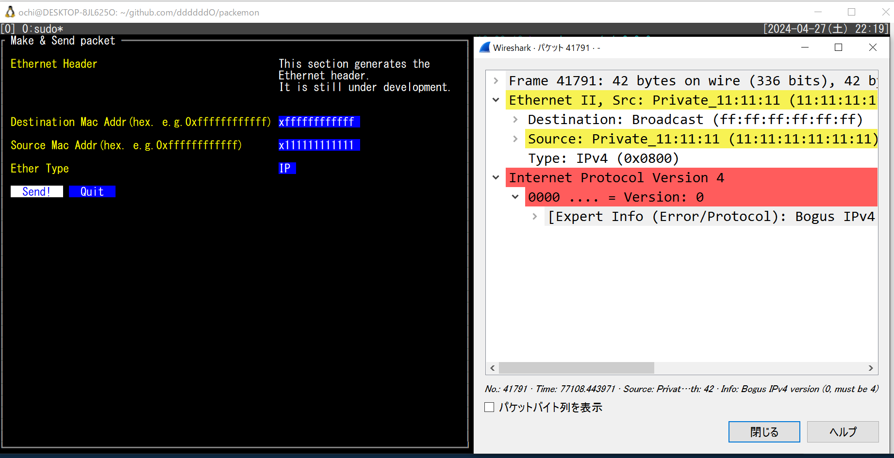
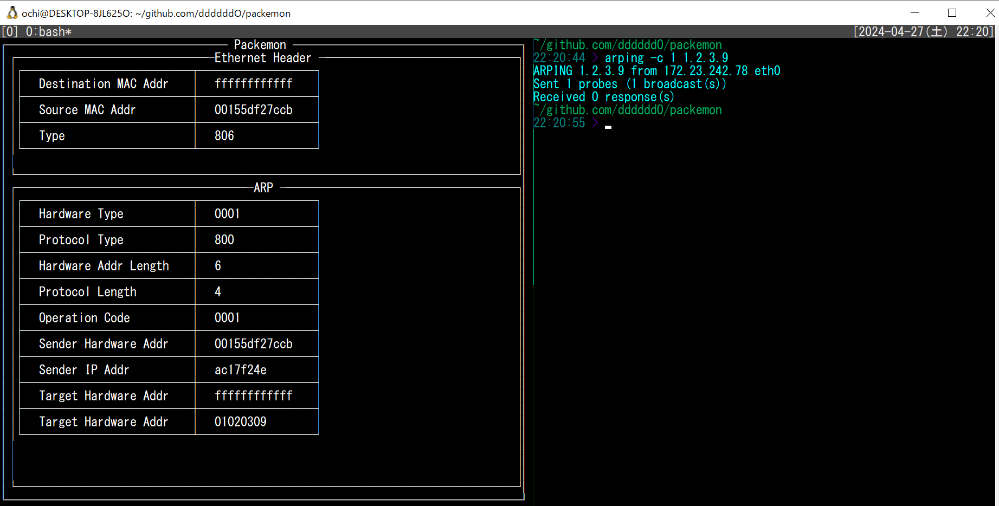

# packemon
- パケットモニター、略してパケモン
- 開発途上で気長にやる予定
- 現在の機能は以下（`578cb8b` のコミット）
  - 任意のイーサネットヘッダーを楽に作れてフレームを送信できる
    
  - フレームを受信して詳細表示（ARPリクエストのみ）
    

- TUIライブラリとして https://github.com/rivo/tview を使わせてもらってる🙇

## 動作確認

### パケットキャプチャ
```console
$ sudo tcpdump -U -i eth0 -w - | /mnt/c/Program\ Files/Wireshark/Wireshark.exe -k -i -
```

```console
$ sudo go run arp.go ethernet.go form.go ipv4.go main.go view.go --send
```

### 手軽にブロードキャスト
```console
$ arping -c 1 1.2.3.4
ARPING 1.2.3.4 from 172.23.242.78 eth0
Sent 1 probes (1 broadcast(s))
Received 0 response(s)
```


## 動作確認の様子
- Ethernetフレームのみ作って送信（`77c9149` でコミットしたファイルにて）

  

- ARPリクエストを作って送信（`390f266` でコミットしたファイルにて。中身はめちゃくちゃと思うけど）

  

- ARPリクエストを受信してパース（`b6a025a` でコミット）

  
  

## 参考
- 「Golangで作るソフトウェアルータ」
  - その実装コード: https://github.com/sat0ken/go-curo
- https://terassyi.net/posts/2020/03/29/ethernet.html
- 動作確認用コマンドの参考
  - https://zenn.dev/takai404/articles/76d47e944d8e18
- [Scrapboxメモ書き](https://scrapbox.io/ddddddo/%E3%83%8D%E3%83%83%E3%83%88%E3%83%AF%E3%83%BC%E3%82%AF%E7%B3%BB%E8%AA%AD%E3%81%BF%E7%89%A9)
