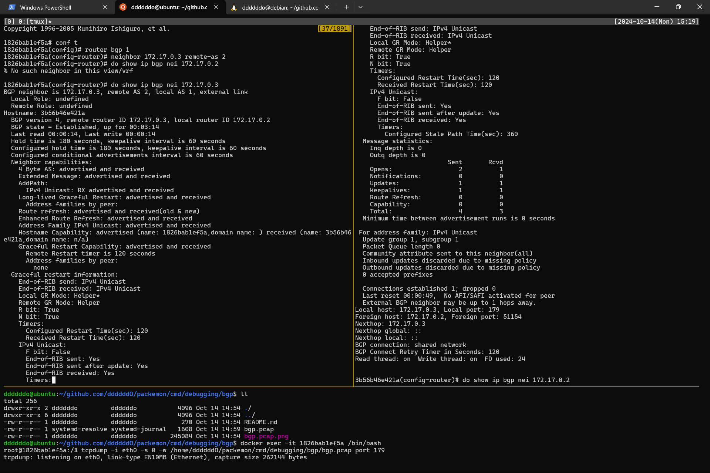
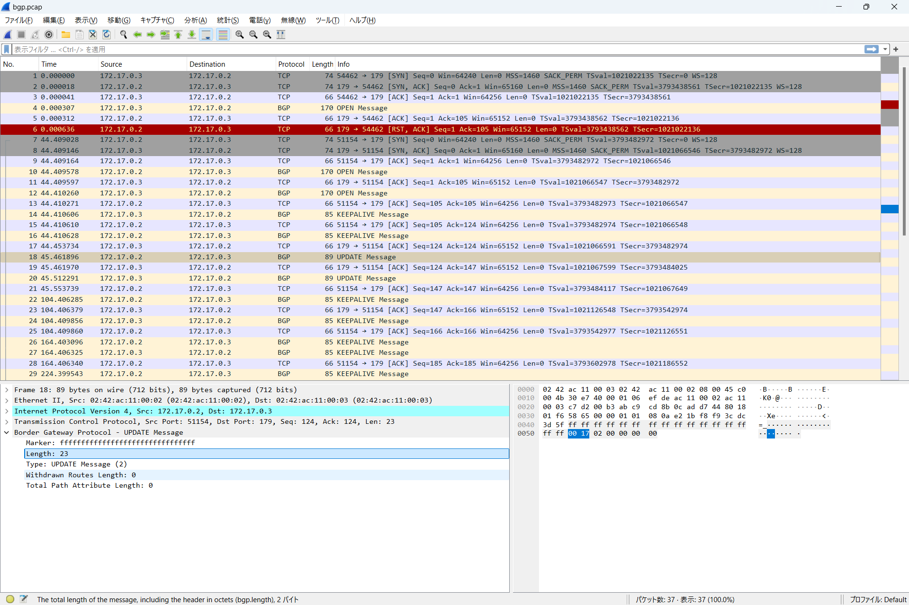

### [この手順](https://github.com/ddddddO/packemon/issues/68#issuecomment-2408943662)で、ピア同士で BGP の通信ができた様子




### BGP の環境を tinet で構築(tmux実行しておく)
以下でインストールした tinet コマンドを利用
```console
curl -Lo /usr/bin/tinet https://github.com/tinynetwork/tinet/releases/download/v0.0.3/tinet.linux_amd64
chmod +x /usr/bin/tinet
tinet --version
```

```console
# 以下の順で、BGP の通信を pcap に取れる環境を作成
$ make up
$ make login
# 以下のみコンテナ内で実行
$ tcpdump -i net0 -s 0 -w /home/ddddddO/packemon/cmd/debugging/bgp/pcap/$(date "+%Y%m%d_%H%M").pcap port 179
$ make conf
# BGP の設定と daemon が動くので少し待つ。その後、CTL+C で tcpdump を止める

# 環境削除
$ make down
```

`/home/ddddddO/packemon/cmd/debugging/bgp/bgp_$(date "+%Y%m%d_%H%M").pcap` のファイルを Wireshark に読み込む

### 参考
- https://milestone-of-se.nesuke.com/nw-advanced/bgp/bgp-sequence-message-format/
    - BGP のシーケンスと BGP の pcap ファイルあり
