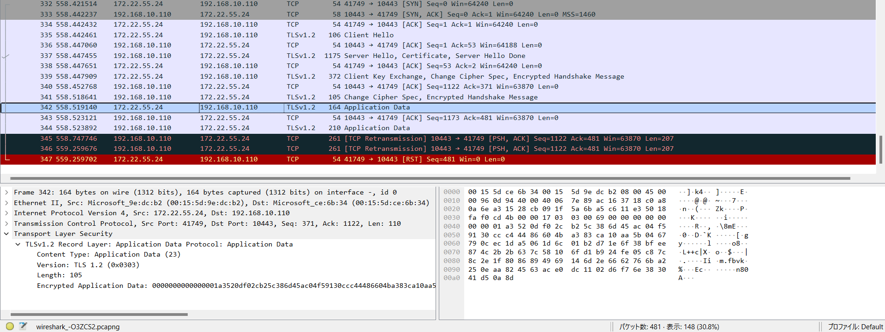
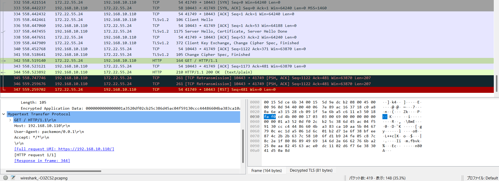
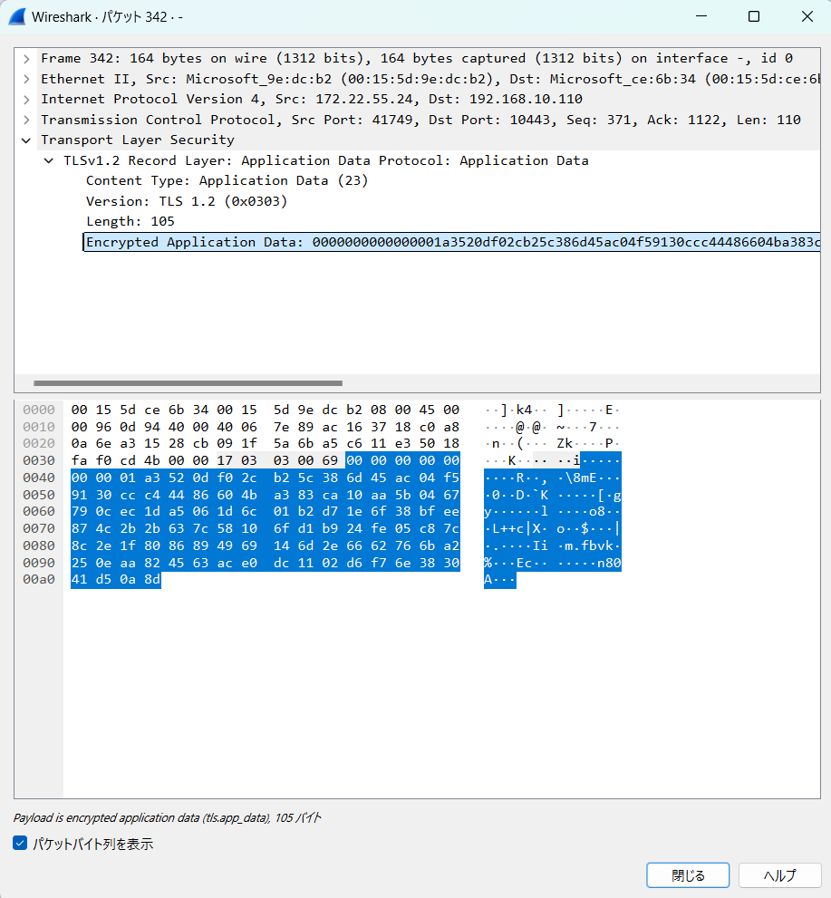
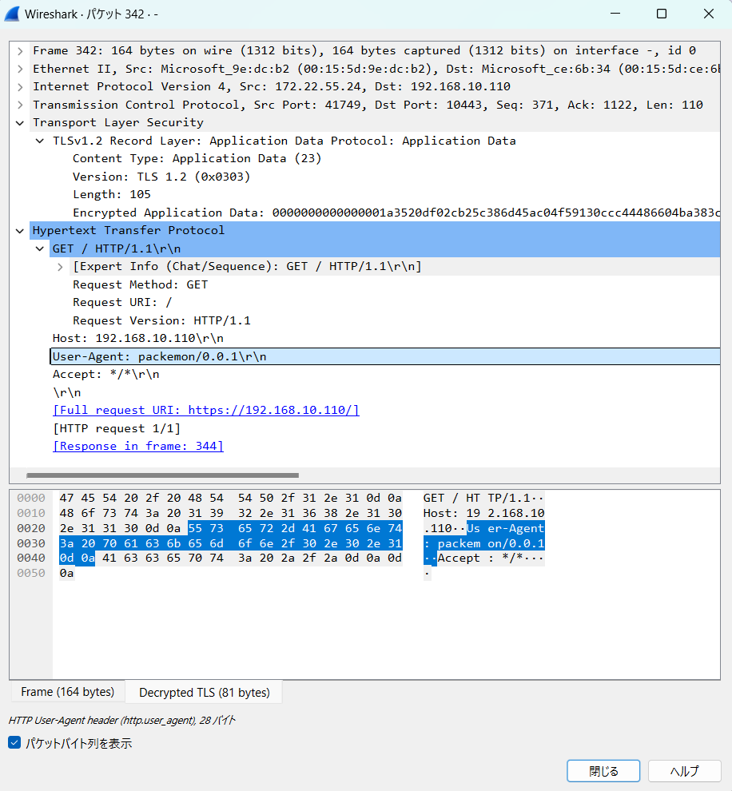
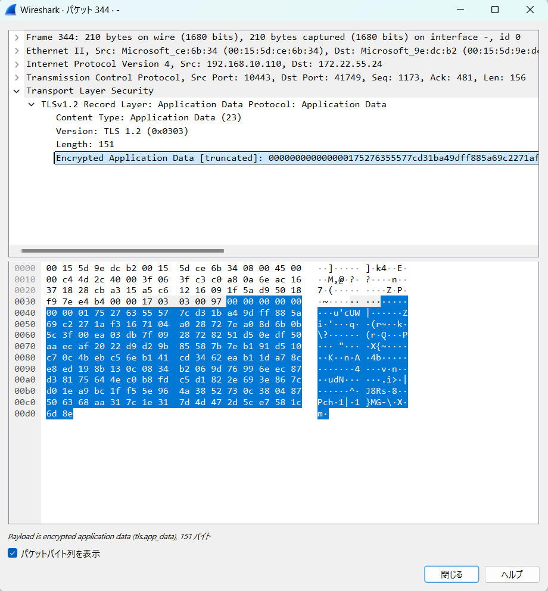
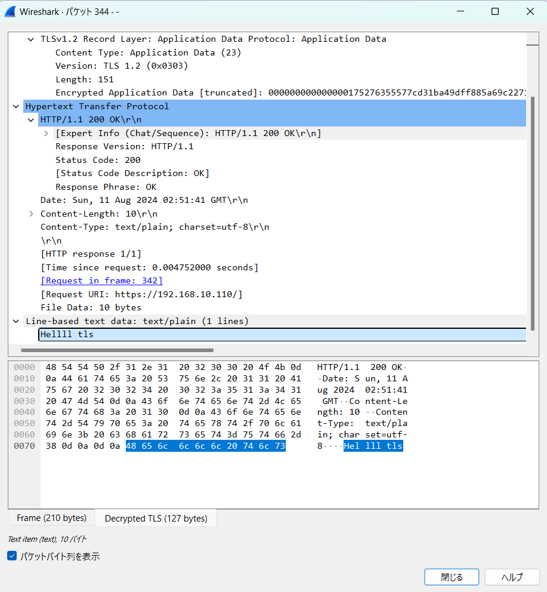

- 準備は、`tls-server` の README 参照
- client は、 `sudo go run cmd/packemon/main.go --send --debug --proto https-get` で HTTP GET を TLSv1.2 でリクエストできる（[そのメソッド](../../../internal/debugging/send_https_get_after_tcp3way_tlshandshake.go)）
  - 新PCからだと数回試行しないと成功しない。たぶんどこかのパケットの生成・パースで固定長で指定してるとかべた書きしてるところが怪しい。

## その様子

|-|暗号化|復号|備考|
|--|--|--|--|
|全体フロー||||
|HTTPリクエスト（GET）||||
|HTTPレスポンス||||

